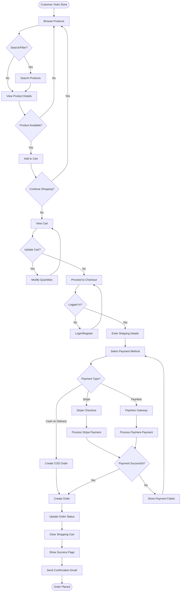
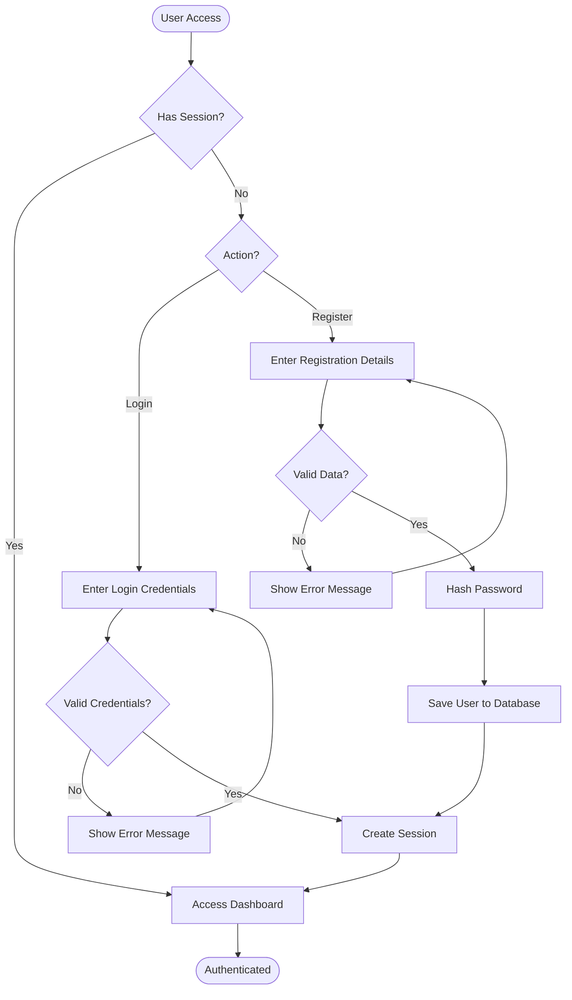
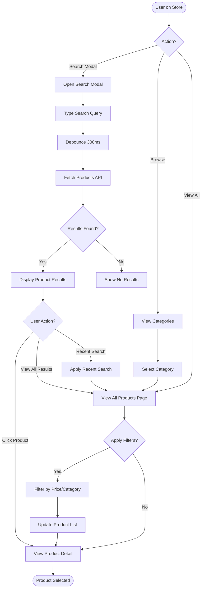
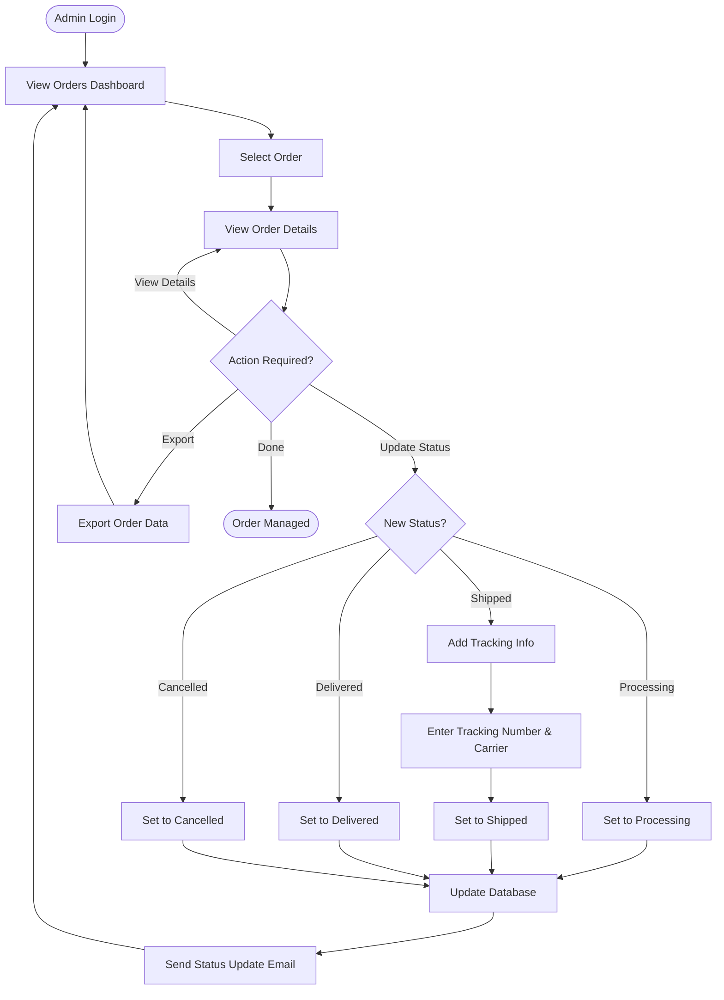
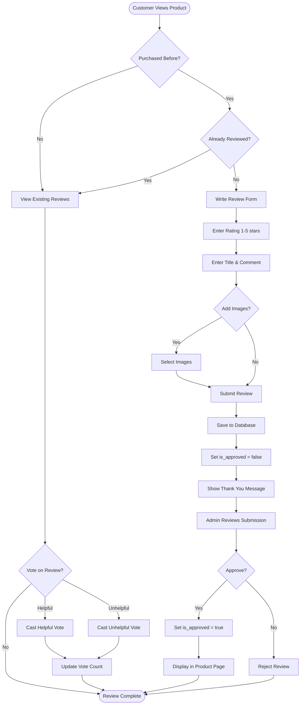
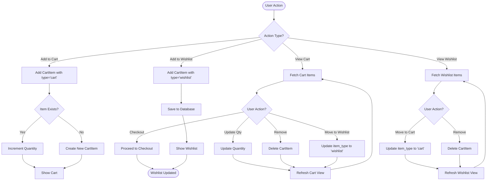
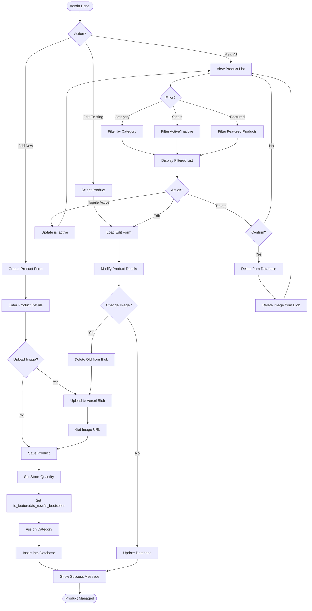

# EasyBuyStore UML Activity Diagrams

## 1. Customer Purchase Flow (Main Activity)

## 2. User Authentication Flow

## 3. Product Search & Browse Flow

## 4. Admin Order Management Flow

## 5. Product Review Flow

## 6. Cart & Wishlist Management Flow

## 7. Admin Product Management Flow

## Flow Descriptions

### 1. Customer Purchase Flow
Main end-to-end flow from browsing to order completion, including:
- Product discovery and search
- Cart management
- Authentication check
- Payment processing (Stripe/PayHere/COD)
- Order creation and confirmation

### 2. User Authentication Flow
Login and registration process with validation and session management.

### 3. Product Search & Browse Flow
Shows how users discover products through:
- Search modal with live results
- Category browsing
- Filtering and sorting
- Recent search history

### 4. Admin Order Management Flow
Admin workflow for:
- Viewing orders
- Updating order status
- Adding tracking information
- Customer notifications

### 5. Product Review Flow
Complete review lifecycle including:
- Purchase verification
- Review submission
- Admin approval process
- Helpful/unhelpful voting

### 6. Cart & Wishlist Management Flow
Shows dual-purpose CartItem entity with type distinction:
- Adding items to cart or wishlist
- Moving items between cart and wishlist
- Quantity management
- Checkout initiation

### 7. Admin Product Management Flow
Product CRUD operations including:
- Creating new products
- Editing existing products
- Image management with Vercel Blob
- Category assignment
- Stock and flag management

## Key Decision Points

- **Authentication Gates**: Many flows check if user is logged in
- **Payment Method Selection**: Three options (Stripe, PayHere, COD)
- **Item Type**: CartItem can be 'cart' or 'wishlist'
- **Order Status Progression**: pending → processing → shipped → delivered
- **Review Approval**: Admin gate before reviews go public
