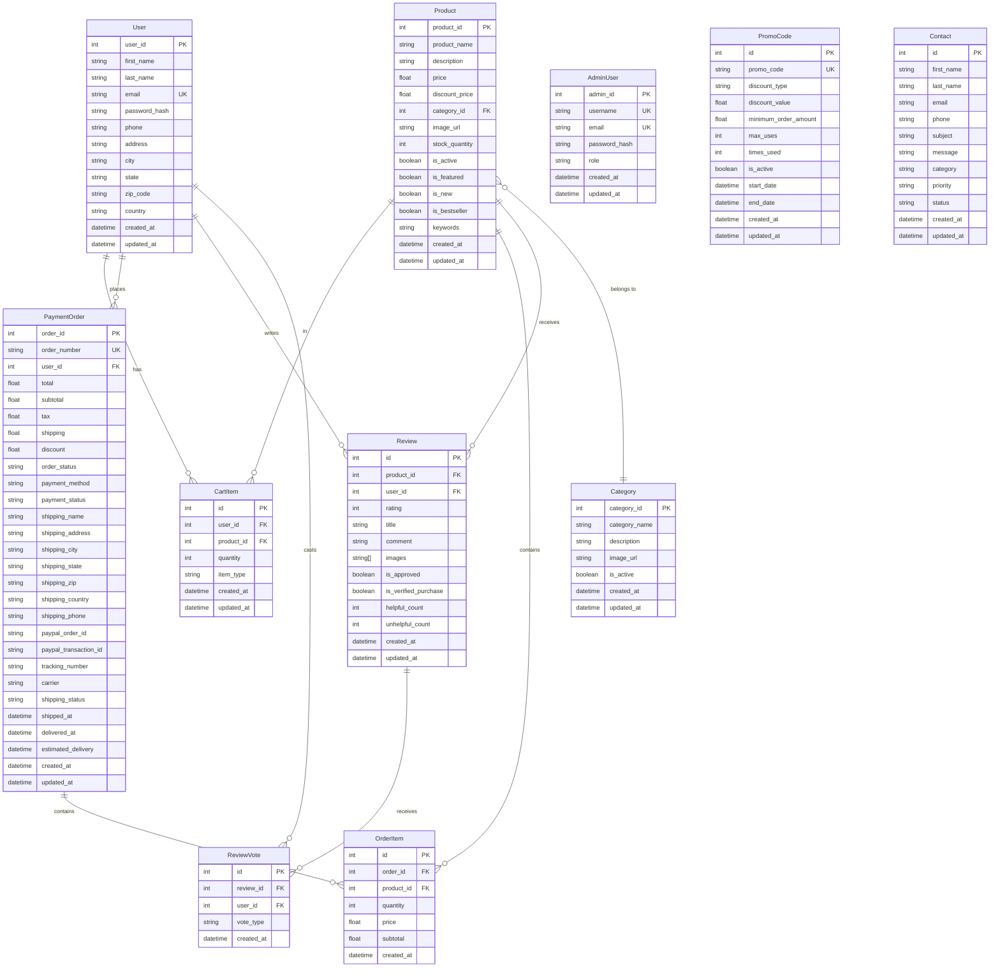

# EasyBuyStore Database ERD

## Entity Descriptions

### Core Entities

- **User**: Customer accounts with authentication and shipping information
- **AdminUser**: Administrative users with role-based access (separate from customers)
- **Product**: Items available for purchase with pricing and inventory tracking
- **Category**: Product categorization and organization

### Transaction Entities

- **PaymentOrder**: Complete order records with payment, shipping, and tracking details
- **OrderItem**: Individual products within an order (line items)
- **CartItem**: Shopping cart and wishlist items (distinguished by `item_type`)

### Engagement Entities

- **Review**: Customer product reviews with ratings and approval workflow
- **ReviewVote**: Helpful/unhelpful votes on reviews (prevents duplicate votes)

### Supporting Entities

- **PromoCode**: Discount codes with usage tracking and validation rules
- **Contact**: Customer support inquiries and contact form submissions

## Key Relationships

1. **User → CartItem → Product**: Shopping cart functionality
2. **User → PaymentOrder → OrderItem → Product**: Order processing flow
3. **Product → Category**: Product organization and filtering
4. **User → Review → Product**: Product feedback system
5. **Review → ReviewVote**: Community-driven review quality

## Notes

- **PK** = Primary Key
- **FK** = Foreign Key
- **UK** = Unique Key
- All entities have `created_at` and `updated_at` timestamps
- CartItem's `item_type` field distinguishes between cart and wishlist items
- PaymentOrder supports multiple payment methods (Stripe, PayPal, etc.)
